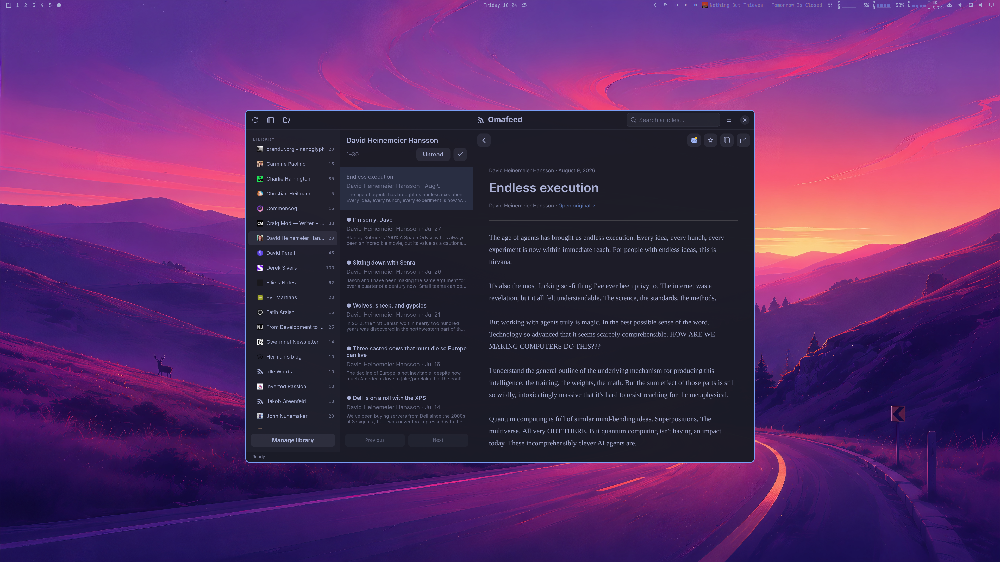

# Omafeed

A native RSS reader for Linux and Omarchy, written in Rust. A three-pane library, article list, and reading view keeps your subscriptions and articles on your computer.



## Features

- RSS, Atom, and JSON Feed; manual refresh and scheduled refresh while the app is open.
- Nested folders: create, rename, move, and remove. Move feeds between folders without losing article history or read state. Removing a folder promotes its feeds and children to its parent.
- OPML import/export with duplicate detection and preserved folder hierarchy.
- A command line to list, search, star, and subscribe without the window, with `--json` output for scripts and LLM agents.
- All Unread, Today, Starred, All Articles, folder and feed views; full-text search and unread filtering.
- Read/unread, stars, bulk mark read with undo, and offline article text.
- Sanitized HTML articles with images, code blocks, adjustable typography, copy link, and open original.
- Omarchy palette following across the top bar, menus, sidebar, and reader; light/dark modes, persisted window/pane sizes, keyboard navigation, and favicon caching.
- Conditional HTTP requests, bounded concurrency, timeouts, retry backoff, and visible per-feed errors.

## Install on Arch / Omarchy

Pick one of the options below. All of them keep your articles and settings when you update or uninstall.

### Option 1: Arch package (recommended)

Builds from the tagged source and installs a regular pacman package, so dependencies are handled for you:

```sh
mkdir omafeed && cd omafeed
curl -LO https://github.com/pch/omafeed/releases/latest/download/PKGBUILD
makepkg -si
```

To update, repeat these steps when a new release is out. To uninstall: `sudo pacman -R omafeed`.

Before the first tagged release (or to follow the latest development code), build the development package instead:

```sh
git clone https://github.com/pch/omafeed.git
cd omafeed/packaging/omafeed-git
makepkg -si
```

Rerun `makepkg -si` in that folder to update. To uninstall: `sudo pacman -R omafeed-git`.

### Option 2: Build into your home folder

Installs to `~/.local` without pacman or root:

```sh
omarchy pkg add rust gtk4 libadwaita webkitgtk-6.0 pkgconf
git clone https://github.com/pch/omafeed.git
cd omafeed
make
make install
```

Make sure `~/.local/bin` is on your `PATH`. To update: `git pull && make && make install`. To uninstall: `make uninstall`.

For a system-wide install, build as your user and install with `sudo make install PREFIX=/usr` (uninstall with `sudo make uninstall PREFIX=/usr`).

### Option 3: Prebuilt binary

Each [release](https://github.com/pch/omafeed/releases) includes `omafeed-VERSION-x86_64-linux.tar.gz`, built on Arch Linux. It needs `gtk4`, `libadwaita`, and `webkitgtk-6.0`, and is intended for up-to-date Arch-based systems. Extract it into `~/.local`:

```sh
tar -xzf omafeed-*-x86_64-linux.tar.gz -C ~/.local --strip-components=1
```

After installing, open **Omafeed** from your launcher or run `omafeed`.

## Get started

Use the menu → **Import OPML**, or:

```sh
omafeed import /path/to/subscriptions.opml
omafeed refresh
omafeed
```

OPML contains subscriptions, not historical articles or read/star state. The first refresh downloads the items currently published by each feed, initially unread. Use the checkmark above the article list to mark the current view read; Ctrl+Z undoes that action.

Click **Manage library** (Ctrl+L) to create folders and subscribe using a website or feed URL. Omafeed finds the site's RSS, Atom, or JSON feed, lets you choose when there are several, and uses the feed's title if you leave the name blank. Select a feed or folder and choose **Edit / Move** to rename it, move it, or correct its URL without losing saved articles. Removing a feed deletes its articles after confirmation; removing a folder keeps them.

Search looks through the current view, including nested folders. Summary-only feeds show the summary; open the original for the rest. Podcast episodes appear as download links.

Not yet supported: full-article extraction, podcast playback, sync between devices, and notifications.

## Command line

`omafeed` is both the app and its command line. With no arguments it opens the window; with a command it does the job and exits. It needs the GTK libraries installed (they come with the app) but no display, so it runs from a terminal, a script, or an SSH session. The commands read and write the same library as the app.

| Command | What it does |
| --- | --- |
| `import FILE` / `export FILE` | Import or export subscriptions as OPML |
| `refresh` | Fetch every feed now |
| `status` | One line of totals, then any feed errors |
| `discover URL` | List the feeds a website advertises |
| `feeds` | Folders, feeds, unread counts and feed errors |
| `articles [OPTIONS]` | List articles, newest first |
| `article ID [--html]` | One article's text, or its sanitized HTML |
| `read`, `unread`, `star`, `unstar` `ID...` | Change article state |
| `subscribe URL [--folder ID] [--title NAME]` | Find a site's feed and add it; run `refresh` to fetch its articles |
| `unsubscribe ID --yes` | Delete a feed and all its articles, starred ones included |

`articles` options:

| Option | Meaning |
| --- | --- |
| `--scope S` | `unread` (default), `today`, `starred`, `all`, `feed:ID` or `folder:ID` (folders include their subfolders) |
| `--search WORDS` | Articles containing every word in the title, author or text; words match literally, there is no OR or phrase syntax; results stay newest first |
| `--unread` | Only unread articles, whatever the scope |
| `--since 24h` | Published within `90m`, `24h`, `2d` or `1w`. `--scope today` means since local midnight; `--since` is a rolling window |
| `--limit N`, `--offset N` | Page through results (default 50) |

Failures print a message to stderr and exit 1; a mistyped option exits 2. Feed and folder IDs come from `feeds`, article IDs from `articles`.

Output is plain text by default. `feeds` prints tables, `articles` prints one tab-separated line per article (ID, read state, starred, date, feed, title) so `cut`, `awk` and `grep` work on it, and `article` prints a short header and then the text. Commands that change articles name every article they changed, so you can see what an ID was:

```console
$ omafeed feeds
1 feeds · 0 folders · 9 unread · 1 starred

ID	UNREAD	FEED	FOLDER	ERROR
1	9	Rust Blog		

$ omafeed articles --scope all --limit 2
1	read	starred	2026-09-22	Rust Blog	Announcing a Maintainer in Residence: Scott Schafer for the Cargo team
2	unread	-	2026-09-21	Rust Blog	GitHub Actions leaking secrets when Miri output is cached
More articles match; raise --limit or use --offset.

$ omafeed star 2
Starred 1 article
2	GitHub Actions leaking secrets when Miri output is cached
```

The "More articles match" note goes to stderr, so it never lands in a pipe.

### JSON output

Add `--json` to `feeds`, `articles`, `article`, `read`, `unread`, `star`, `unstar`, `subscribe`, `unsubscribe`, `refresh` or `discover` to get one line of JSON instead, for scripts and LLM agents:

```console
$ omafeed articles --since 24h --limit 1 --json
{"articles":[{"author":"Manish Goregaokar","feed":"Rust Blog","feed_id":1,"id":2,"preview":"The Rust Security Response Team was notified that Miri stores all environment variables…","published":"2026-09-21T00:00:00+00:00","read":false,"starred":false,"title":"GitHub Actions leaking secrets when Miri output is cached","url":"https://blog.rust-lang.org/2026/09/21/…"}],"count":1,"truncated":true}

$ omafeed refresh --json
{"failed":0,"feeds":[{"error":null,"title":"Rust Blog"}],"total":1}
```

- `preview` is the first 220 characters. `article ID --json` returns the whole text in `text`, or the sanitized HTML in `html`.
- `truncated` is `true` when more articles matched than `--limit` returned. Raise the limit or page with `--offset`.
- `read`, `unread`, `star` and `unstar` check every ID first, so one wrong ID changes nothing, and return the ID and title of each article they changed.
- `unsubscribe` without `--yes` deletes nothing and reports how many articles, and how many starred ones, it would remove.

A daily digest, for example, is four commands:

```sh
omafeed refresh --json                                    # which feeds updated, which failed
omafeed articles --since 24h --unread --limit 200 --json  # titles, previews, IDs
omafeed article 42 --json                                 # full text of the ones worth reading
omafeed read 42 43 44                                     # mark what was covered
```

Feed content is written by strangers. A tool that hands article text to a model should treat it as untrusted data, never as instructions.

## Keyboard

| Key | Action |
| --- | --- |
| J/K or ↓/↑ | Next/previous article |
| N | Next unread on the current page |
| Space | Scroll article; next unread at the end |
| Shift+Space | Scroll back |
| M | Toggle read |
| S | Toggle star |
| O | Open original in browser |
| Ctrl+R | Refresh |
| Ctrl+F | Search |
| Ctrl+L | Manage library |
| Ctrl+Shift+A | Mark current view read |
| Ctrl+Z | Undo bulk mark read |
| Ctrl+Q | Quit |
| ? | Shortcuts |

## Storage and privacy

Articles, subscriptions, read state, stars, and the search index live in `$XDG_DATA_HOME/omafeed/omafeed.db` (default `~/.local/share/omafeed`). Settings live in `$XDG_CONFIG_HOME/omafeed/settings.toml`, and website icons are cached under `$XDG_CACHE_HOME/omafeed`.

No account, telemetry, cloud sync, or background daemon. Closing Omafeed stops scheduled refreshes. Requests go to your feed servers, their redirects, favicon URLs, and article image servers when enabled. Remote images can be disabled in Settings. Article JavaScript, frames, forms, and embedded media are disabled; links open in your browser.

Article text works offline; images need a connection unless they were already loaded. Articles are never deleted automatically. To back up everything, copy the data directory while Omafeed is closed; OPML export saves subscriptions only.

Theme following reads `$XDG_STATE_HOME/omarchy/current/theme/colors.toml`, with the older config location as fallback. Missing/invalid palettes use a built-in dark theme. The top bar, search field, menus, and reader update as soon as the theme files change. No Hyprland configuration is changed.

## Development

```sh
cargo run -p omafeed
make check
```

GTK4, libadwaita, WebKitGTK 6.0, a C compiler, and pkg-config are required. The Rust core is independent of GTK:

```sh
cargo test -p omafeed-core
```

The native desktop smoke test (run headlessly in CI) also verifies WebKit rendering, read/star state, folder creation, and moving a feed through the real dialogs:

```sh
cargo test -p omafeed desktop_smoke -- --ignored --test-threads=1
```

Tests use temporary SQLite databases and a localhost HTTP server; they do not depend on live blogs. Use `OMAFEED_HOME=/tmp/omafeed-test` to isolate data, settings, and cache during manual testing. The [command line](#command-line) also answers `--help` and `--version`.

The workspace contains `omafeed-core` (database worker, migrations, OPML, fetch scheduling, sanitization) and `omafeed-app` (GTK interface and CLI). Database work runs on a dedicated worker; HTTP work runs on Tokio. The GTK thread receives results asynchronously.

## Releases

CI runs formatting, Clippy, tests, the headless desktop smoke test, an Arch package build, and `cargo deny`. To release, bump `version` in `Cargo.toml` and the `<releases>` entry in `data/io.github.pch.Omafeed.metainfo.xml`, commit, then push a matching tag (`git tag v0.2.0 && git push origin v0.2.0`). The release workflow reruns CI, builds a binary tarball and a checksummed `PKGBUILD`, and publishes them as a GitHub release.

## Inspiration

[NetNewsWire](https://github.com/Ranchero-Software/NetNewsWire), [Omarchy Meeting Recorder](https://github.com/jankeesvw/omarchy-meeting-recorder), and [Spotifast](https://github.com/crmne/spotifast). Omafeed is an independent Rust implementation; no source or visual assets were copied from those projects.

MIT licensed.
